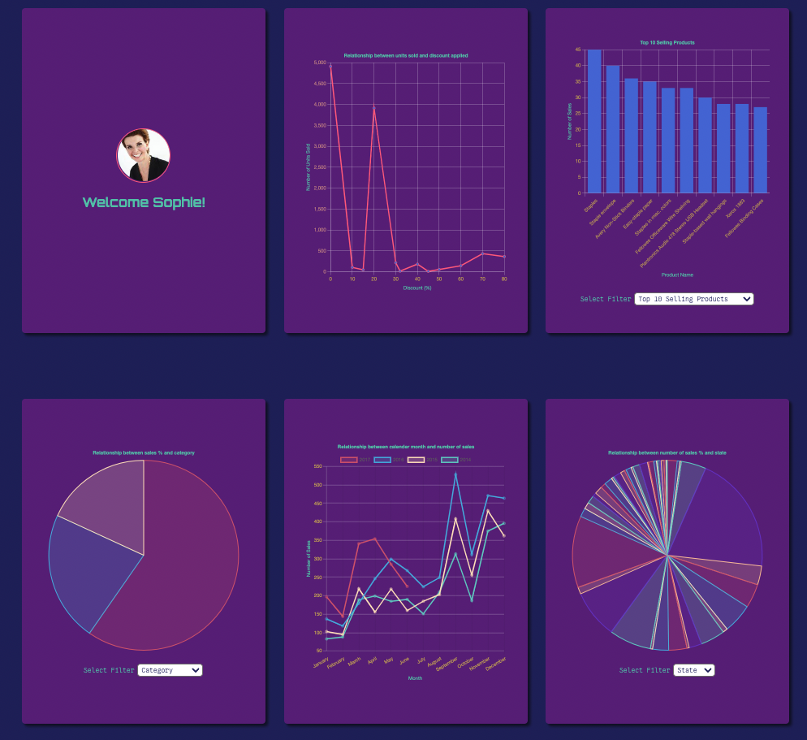

# Sky High UI

<figure style="width: 100%; display: flex; justify-content: center; align-items: center; flex-direction: column">

<figcaption>
A screenshot of the live site.
</figcaption>
</figure>

## Project Overview

The goal of this project was to create a React Aplication to display data from the Sky High API and display historical data in an insightful manner so that the marketing team can use the information to aid them as they embark on a new promotion campaign.

## Design Approach

### Chart.js & React Chart.Js

Chart.js was used to display data in a range of formats. Based on previous experience displaying chart data with chart.js with vanilla javascript, it was fairly simple to transition to using the npm package with react.

### Axios for API Calls

Based on the ease with which Axios enables API fetch requests to be made, I elected to use it over the built-in fetch method.

### Reusable Util Functions to Parse Data

I made as many of the data parsing functions pure and reusable, to achieve DRY code.

### React Hooks to Manage State

Due to the simplicity of a the application structure, I was able to use React Hooks to manage state without any additional packages, keeping the application lightweight. Callback functions were used to lift up state where necessary.

### Lighthouse for Accessibility and SEO

Lighthouse was used to assess the accessibility and SEO of the site. Based on the feedback provided by Lighthouse, the application ultimately scored 100% for both accessibility and SEO on both mobile and desktop.

### ESLint

ESLint was used to ensure any unused imports, missing dependencies, etc. were removed/added as required in order to prevent bugs occuring.

### Potential For Future

Chart.js was a fast way to present the data with ease based on the time constraint of the project. However, if the application was to be redesigned I would like to learn and use D3 as it offers greater controller for the user.

## Links

### Deployed Site

https://samueljacobs98.github.io/sky-high-ui/

### GitHub Repo

https://github.com/samueljacobs98/sky-high-ui
